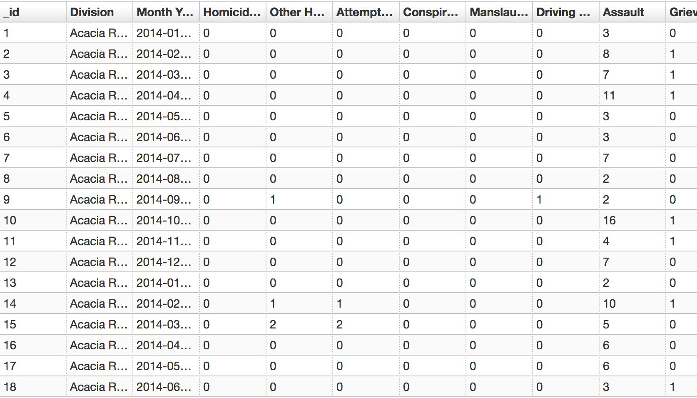

# Project Proposal
### Roy Portas

## What

The topic for my project is QLD Police crime data, specifically geolocation
data over time. It is envisioned that the crime data can be analysed to find correlations over time, type of the crime and the location of the crime.

Additionally this can be combined with data containing Neighbourhood Watch
Areas and Police Beat locations to visualize the effectiveness of each program
and the impact it has on the crime rates.

## Why

The crime data is specific to Queensland and the Brisbane area, thus its
spatially relevant to where we live. Additionally crime is a part of our
society 

## How

I will be using Matlab with Webmaps to visualize the geolocation data and
plotting quantitative data.


## Data sources

### Offence Numbers by Police Region

URL: [https://data.qld.gov.au/dataset/offence-numbers-police-divisions-monthly-from-july-2001/resource/34f74f13-3269-4916-b1a8-c5ba825972af](https://data.qld.gov.au/dataset/offence-numbers-police-divisions-monthly-from-july-2001/resource/34f74f13-3269-4916-b1a8-c5ba825972af)

Sample:


### Crimes by Location

URL: [https://data.qld.gov.au/dataset/crime-locations-2000-present](https://data.qld.gov.au/dataset/crime-locations-2000-present)

How to access:

```bash
curl https://data.police.qld.gov.au/api/boundary?name=brisbane&returngeometry=true&maxresults=5
```

### Neighbourhood Watch Areas

URL: [https://data.qld.gov.au/en/dataset/qps-neighbourhood-watch-areas](https://data.qld.gov.au/en/dataset/qps-neighbourhood-watch-areas)

The file is provided in a Shapefile format which can be easily imported into
Matlab


### QPS Police Beat Locations

URL: [https://data.qld.gov.au/en/dataset/qps-police-beats](https://data.qld.gov.au/en/dataset/qps-police-beats)

The file is provided in a Shapefile format which can be easily imported into
Matlab
